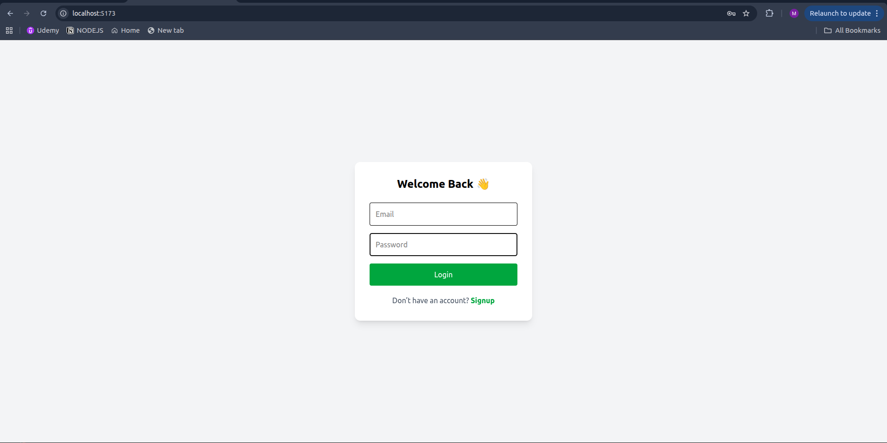
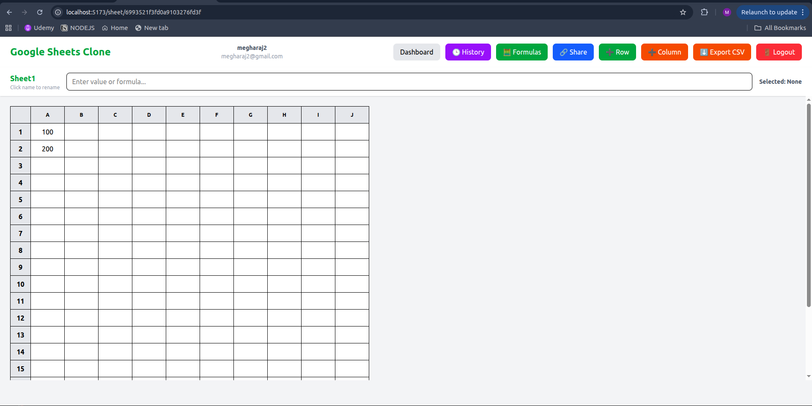
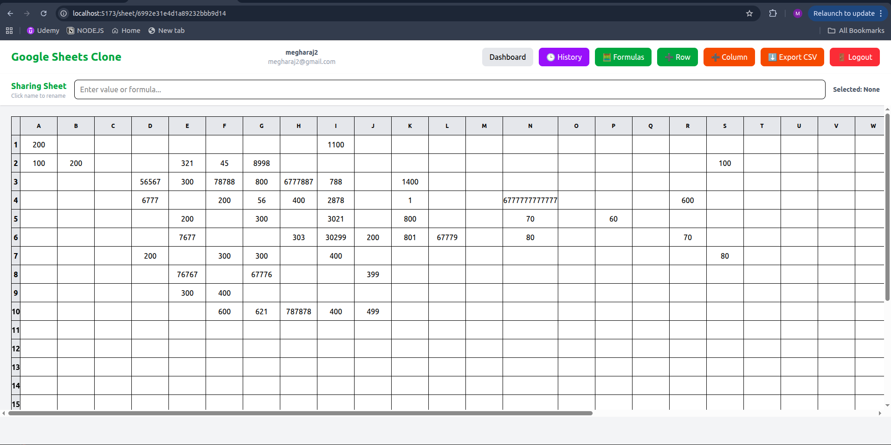
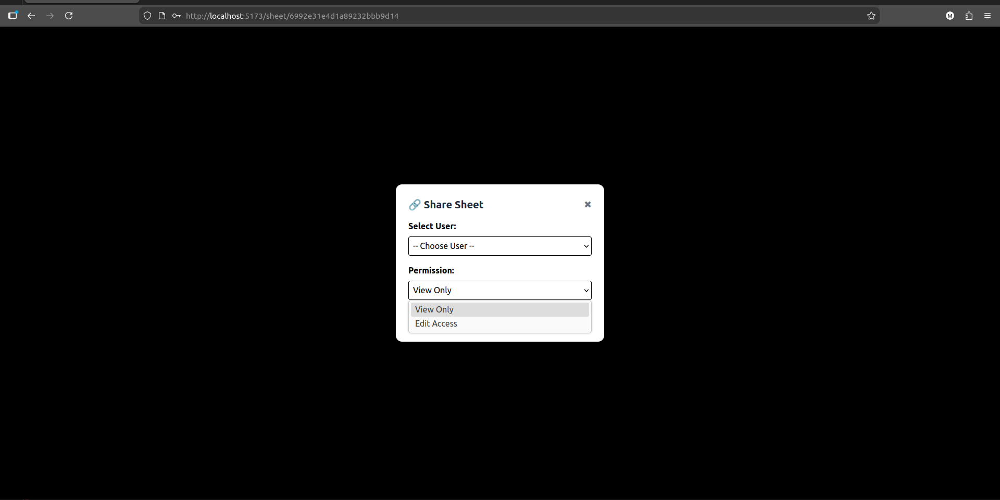

# 📊 Google Sheets Clone — Real-Time Collaborative Spreadsheet

A full-stack **Google Sheets Clone** built using the **MERN stack** with real-time collaboration, spreadsheet formulas, sharing permissions, edit history, rollback support, and CSV export.

This project was developed as part of an assignment to replicate core spreadsheet features of Google Excel / Google Sheets.

---

# 🚀 Live Features

## ✅ Core Spreadsheet Features

- User Authentication (Signup / Login using JWT)
- Create new sheets with custom rows & columns
- Dynamically add new rows and columns
- Rename sheets
- Auto-save sheet data into MongoDB

---

## 🧮 Formula Support

- Supports basic mathematical operations:

    - Addition (`+`)
    - Subtraction (`-`)
    - Multiplication (`*`)
    - Division (`/`)

- Formula Example:
- If cell A1 contains `5` and cell B1 contains `10`, entering `=A1+B1` in cell C1 will display `15`.
Automatically recalculates dependent cells when referenced values change

Formula values persist correctly after refresh

## Sharing & Permissions

- Share sheets with one or multiple users
     - Permission Levels:

         - View Only: Can view the sheet but cannot make edits
         - Edit: Can view and edit the sheet

- Shared users can access sheets inside "Shared With Me" section

## Real-Time Collaboration (Socket.IO)

- Live editing updates across multiple users instantly  
- Concurrent editing supported
- Conflict indicator shows when another user is selecting the same cell

- Example:

    - User A enters 10
    - User B enters 20
    - Both users instantly see 20

## Cell History + Restore (Rollback)
- Each cell maintains its own history:
    - Edited By (User Name + Email)
    - Old Value → New Value
    - Timestamp
    - Restore previous values with one click

## Export Sheet as CSV
- Export full spreadsheet data into raw CSV format
- Downloaded file opens correctly in Excel / LibreOffice

# 🛠️ Tech Stack

- Frontend 
    - React.js
    - Tailwind CSS
    - Axios
    - Socket.IO Client

- Backend
    - Node.js
    - Express.js
    - MongoDB + Mongoose
    - JWT Authentication
    - Socket.IO Server

## 📸 Screenshots
### Login Page

---

### Signup page

### 🧾 Spreadsheet UI (Main Sheet View)

---

### 📄 Spreadsheet Example (Sheet1)

---

### ✏️ Cell Editing with Editor Name Display

---

### 🔗 Share Modal

---

### 📤 Shared Sheet View

---

### 📌 Share Sheet Popup

---

### 🔐 Permission Control Modal

---

### 🕒 Version History & Rollback Feature

